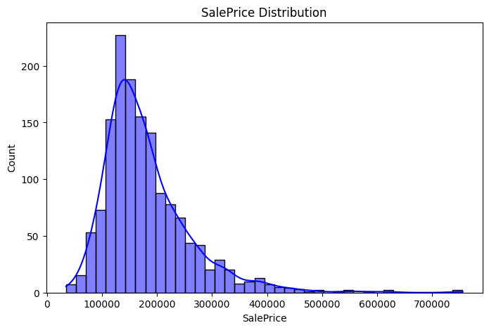
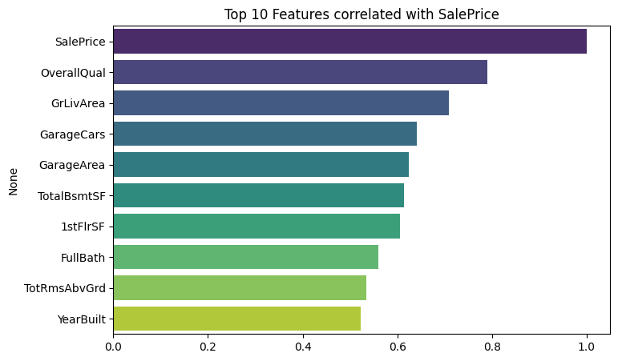
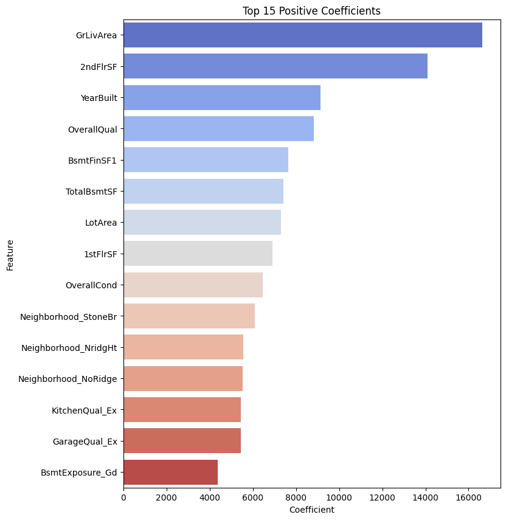
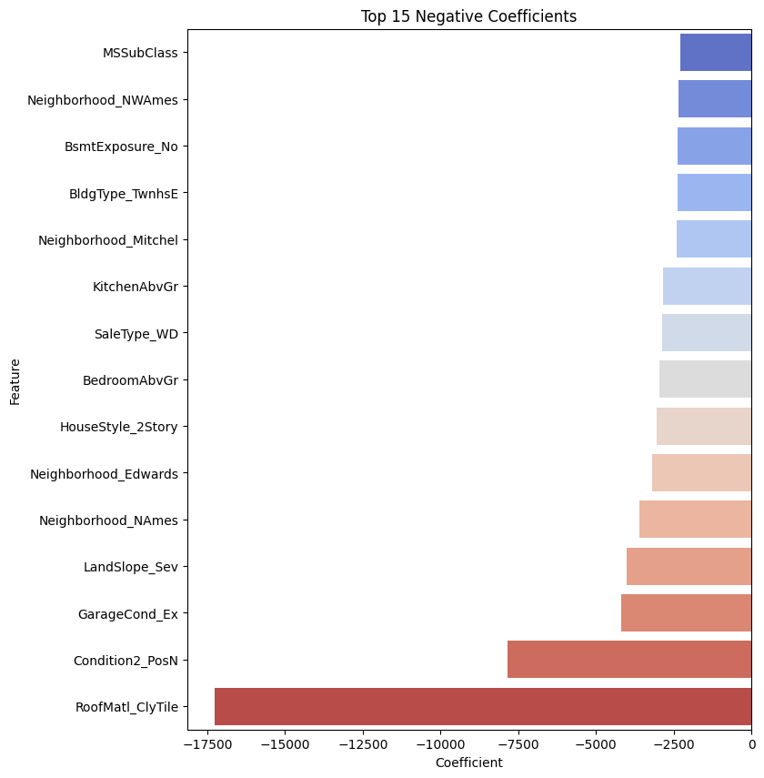

# 🏡 SCT_ML_1 – House Price Prediction (Linear Regression)

## 📌 Project Overview
This project predicts **house sale prices** based on various property features using **Linear Regression**. The dataset is from **Ames, Iowa**, and contains both **numerical and categorical features** describing the properties.

**Goal:** Predict the `SalePrice` for unseen houses in the test dataset.

This is a **regression problem**, as the target variable is continuous (price in USD). The project demonstrates **data preprocessing, EDA, model training, and evaluation** using Python and Scikit-Learn.

---

## 📂 Dataset
**Dataset Source:** [Kaggle – House Prices: Advanced Regression Techniques](https://www.kaggle.com/c/house-prices-advanced-regression-techniques/data)

**Files in the dataset:**
- `train.csv` – training data with features and `SalePrice`.  
- `test.csv` – test data without `SalePrice`, used for predictions.  
- `data_description.txt` – detailed description of all features.  
- `sample_submission.csv` – example submission file format.

**Target Variable:**  
- `SalePrice` → sale price of the property (in USD)

**Feature Types:**
- **Numerical Features:** LotArea, YearBuilt, GrLivArea, TotalBsmtSF, GarageCars, etc.  
- **Categorical Features:** MSZoning, Neighborhood, HouseStyle, GarageType, CentralAir, SaleCondition, etc.

Categorical features are **one-hot encoded** to convert text values into numerical columns for the model.

---

## 🔎 Exploratory Data Analysis (EDA)

**SalePrice Distribution:**  
This plot shows the distribution of house prices in the training set. Skewness or outliers can be identified from this.  


**Top 10 Features Correlated with SalePrice:**  
This bar plot shows which features are most positively or negatively correlated with house prices.  


EDA helps in **understanding the data, detecting outliers, and identifying important features**.

---

## ⚙️ Preprocessing Steps

1. Separated **target (`SalePrice`)** and **features**.  
2. Filled **missing values**:
   - Numerical → median  
   - Categorical → mode  
3. Converted **categorical features** to numerical using **one-hot encoding**.  
4. Aligned train and test sets → ensures same columns for both datasets.  
5. Scaled numerical features using **StandardScaler** → improves Linear Regression performance.

All preprocessing ensures the **data is clean and ready for modeling**.

---

## 🚀 Model Training

- **Model Used:** Linear Regression  
- **Train-Test Split:** 80%-20%  
- **Cross-Validation:** 5-fold

**Validation Metrics:**  
- RMSE: `Insert your value`  
- R² Score: `Insert your value`  
- Mean CV R²: `Insert your value`

Linear Regression provides **baseline predictions**. Advanced models like Ridge, Lasso, Random Forest, or XGBoost can improve accuracy.

---

## 🔧 Feature Importance

Linear Regression coefficients indicate **how each feature impacts SalePrice**.

**Top Positive Coefficients (increase price):**  


**Top Negative Coefficients (decrease price):**  


Feature importance helps in **interpreting model predictions** and understanding key factors influencing house prices.

---

## 📦 Submission

The model predicts house prices for the test set and saves the results in `submission.csv`:

```text
submission.csv
